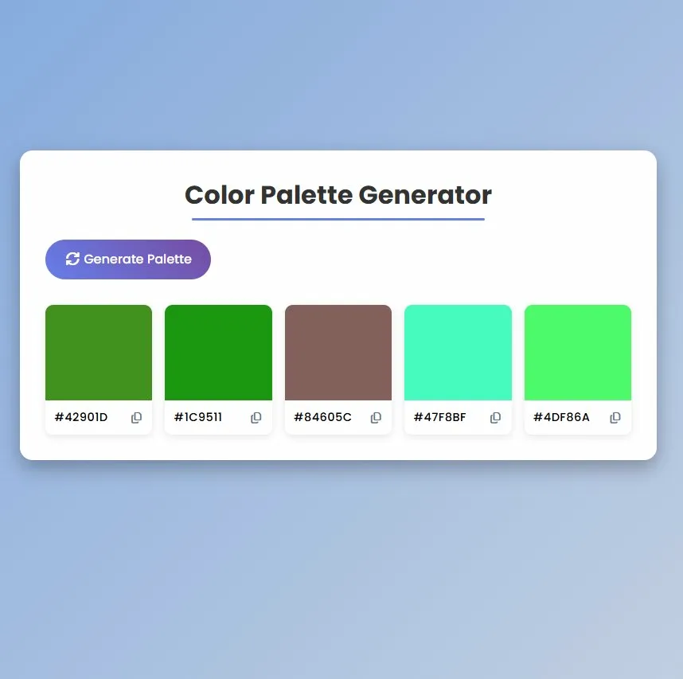

# Color Palette Generator

## About

A simple web application for generating random color palettes with an intuitive interface.

## Live Demo

https://color-pallete-generator27.netlify.app/

## Features

- **Random Palette Generation**: Generate five random colors with a single click
- **One-Click Copy**: Copy hex color codes to clipboard by clicking the color box or copy icon
- **Visual Feedback**: Copy confirmation with checkmark animation
- **Responsive Design**: Adapts to different screen sizes
- **Modern UI**: Clean interface with gradient backgrounds and smooth animations

## Tech Stack

- HTML5
- CSS3
- JavaScript

