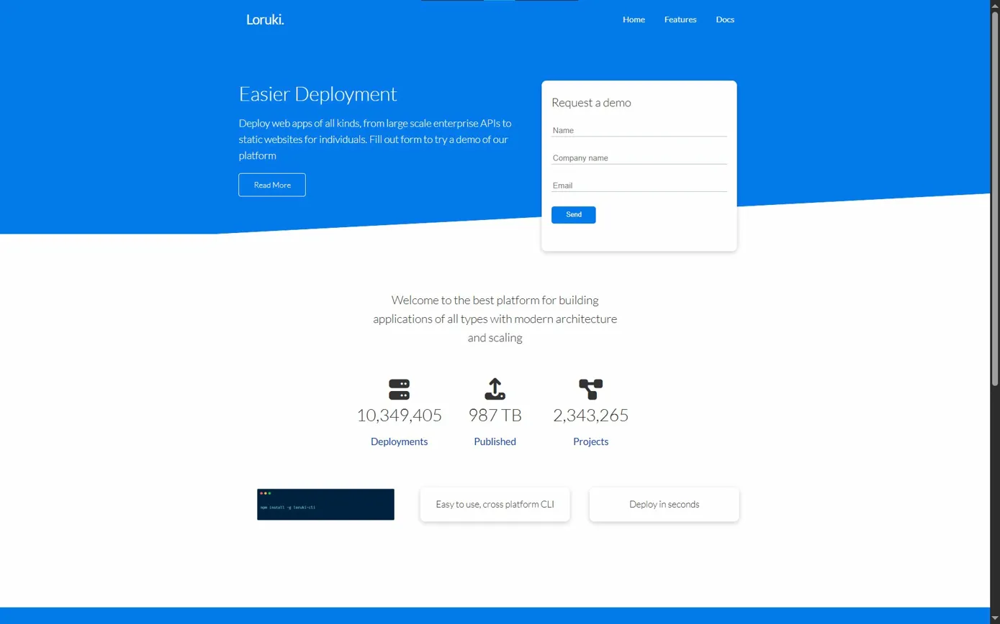

# Loruki - Cloud Hosting Platform

A cloud hosting platform for deploying and scaling web applications

## Live Demo

[View Live Site](https://loruki-demo-website-2.netlify.app/)

## Features

- Fully responsive design
- Multi-page layout (Home, Features, Docs)
- Interactive demo request form
- Support for 8+ programming languages
- Modern UI with clean interface

## Tech Stack

HTML5 | CSS3 | JavaScript

## License

MIT License
