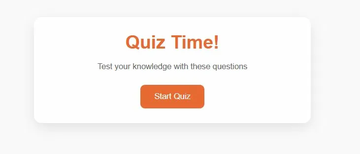
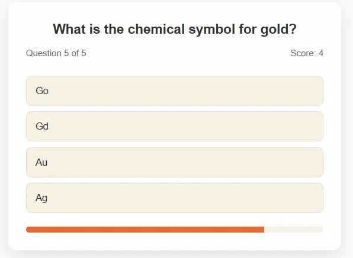
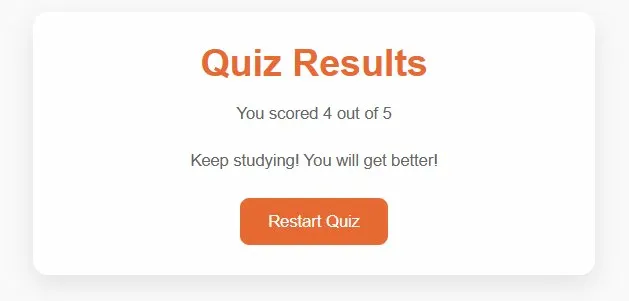

# Quiz Game

<table align="center">
  <tr>
    <td align="center" width="33%"></td>
    <td align="center" width="33%"></td>
    <td align="center" width="34%"></td>
  </tr>
  <tr>
    <td align="center"><em>Start Screen</em></td>
    <td align="center"><em>Quiz Question</em></td>
    <td align="center"><em>Results Screen</em></td>
  </tr>
</table>

## About

An interactive quiz game testing general knowledge across multiple topics with score tracking and instant feedback

## Live Demo

https://quiz-game88.netlify.app

## Features

- Multiple choice questions
- Score tracking
- Visual progress bar
- Instant answer feedback
- Responsive design

## Tech Stack

HTML | CSS | JavaScript

## License

MIT License - See [LICENSE](../LICENSE) file for details
