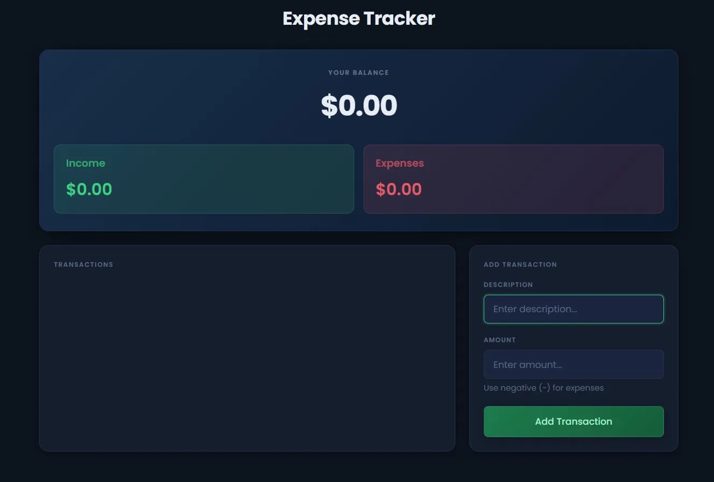

# Expense Tracker

## About
A simple and intuitive web application for tracking personal income and expenses

## Live Demo
https://expense-tracker-six-olive.vercel.app/

## Features

- **Balance Overview** - Real-time display of current balance
- **Income & Expense Tracking** - Separate tracking for income and expenses
- **Transaction Management** - Add and view all transactions in one place
- **Simple Interface** - Clean, user-friendly design for easy navigation

## Usage

- Enter a transaction description
- Input the amount (use negative values for expenses)
- Click "Add Transaction" to record
- View your updated balance and transaction history

## Tech Stack

HTML5 | CSS3 | JavaScript

## License

MIT License
