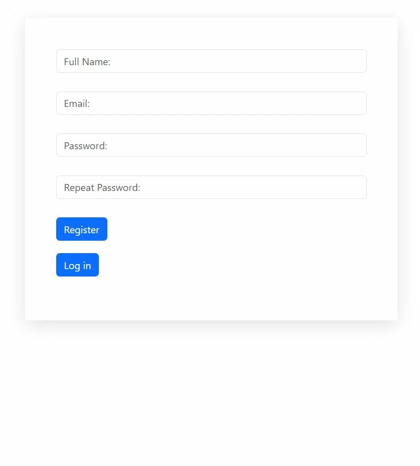

<div align="center">

# Log In Form

</div>

<table>
  <tr>
    <td align="center" width="50%"><br/><b>Log in Page</b></td>
    <td align="center" width="50%"><br/><b>Registration Page</b></td>
  </tr>
</table>

## About

A secure authentication system with user registration, log in and session management

## Live Demo

https://loginform.infinityfreeapp.com/login.php

## Tech Stack

PHP | MySQL | HTML | CSS | Bootstrap 5

## Database Setup

Create a database and run:
```sql
CREATE TABLE users (
    id INT AUTO_INCREMENT PRIMARY KEY,
    full_name VARCHAR(100),
    email VARCHAR(100) UNIQUE,
    password VARCHAR(255),
    failed_attempts INT DEFAULT 0,
    lockout_time DATETIME DEFAULT NULL
);
```

## Installation

- Clone the repository and place files in your server's web directory (e.g., `htdocs`)
- Update database credentials in `database.php`
- Start Apache and MySQL
- Navigate to `http://localhost/log-in-form/registration.php`

## Production

Before deploying:
- Change default database credentials
- Enable HTTPS
- Add CSRF protection
- Implement rate limiting
- Add email verification

⚠️ Built as a portfolio project, not intended for commercial use

## License

MIT License
