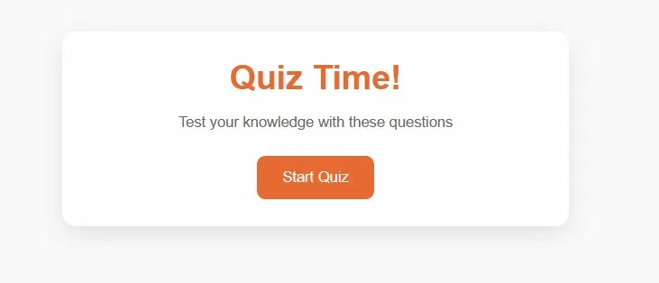
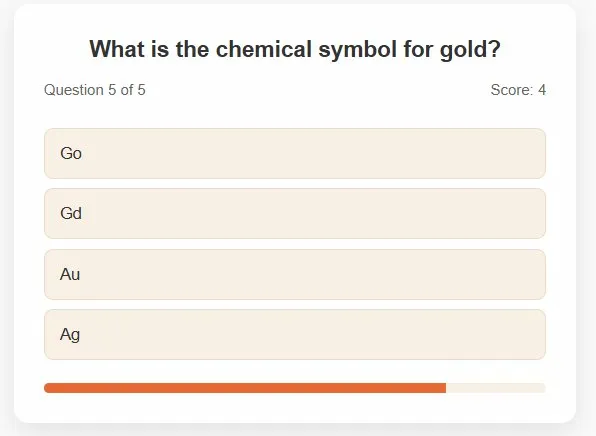
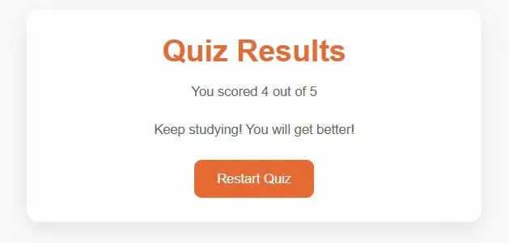

# Quiz Game

<table>
  <tr>
    <td align="center" width="33%"> <b>Start Screen</b></td>
    <td align="center" width="33%"> <b>Quiz Question</b></td>
    <td align="center" width="33%"> <b>Results Screen</b></td>
  </tr>
</table>

## About
An interactive quiz game testing general knowledge across multiple topics with score tracking and instant feedback

## Live Demo
https://quiz-omega-three-97.vercel.app/

## Features

- Multiple choice questions
- Score tracking
- Visual progress bar
- Instant answer feedback
- Responsive design

## Tech Stack

HTML | CSS | JavaScript

## License

MIT License
