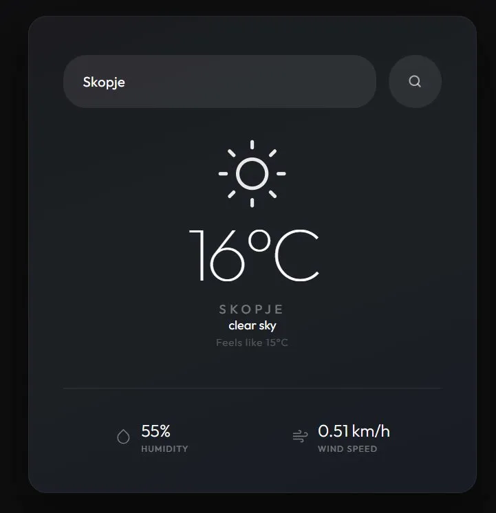

# Weather App

| Weather Result | Search Bar |
|:---:|:---:|
|  |  |

## About

A weather app that displays temperature, humidity, wind speed and conditions for any city in the world

## Live Demo
https://weather-app-navy-sigma-27.vercel.app/

## Features
- **Live Weather Data** - Fetched via OpenWeatherMap API
- **Global Coverage** - Supports cities from every country
- **Dynamic Icons** - Weather icons that change based on conditions
- **Instant Results** - Searches on submit with live feedback
- **Responsive** - Optimized for all screen sizes

## Tech Stack

HTML5 | CSS3 | JavaScript

## License
MIT License
